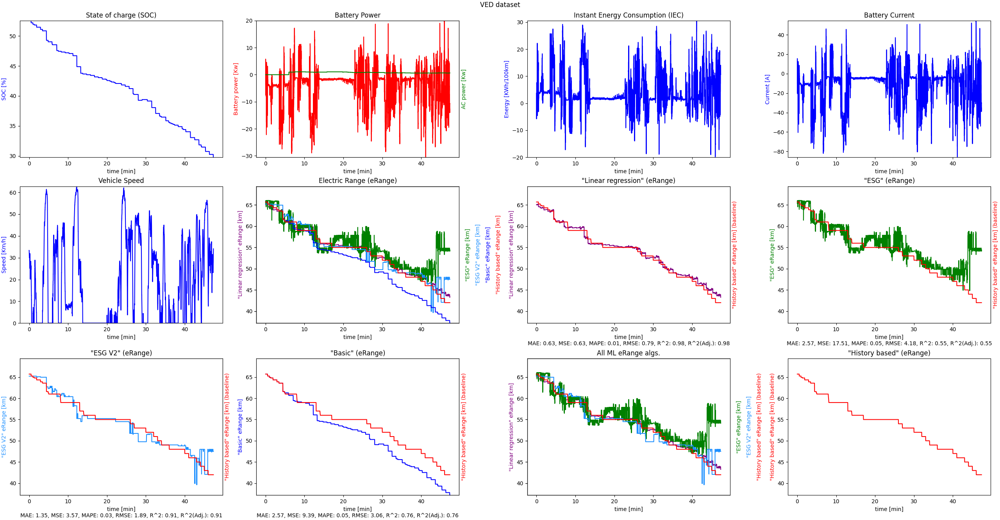

# TFM18-2122i

## Project struture

- **pdf** - The thesis pdf and some other documents
- **tfm18** - The project's source code
    - **data** - Where dataset files are located
        - **\*.pickle** - Files that have preprocessed data and are used to speed up the application.
    - **src** - The python source code of the application.
        - **algorithm** - Algorithms used to predict EV trip's eRange.
        - **dataset** - Dataset readers that standarize the data from each dataset to be fed to the prediction algorithm.
        - **emobpy** - Emobpy's example code integrated into this thesis for analysis.
        - **evaluation** - Algorithms used evaluation an EV trip's eRange prediction alorithm performance.
        - **execution** - Executes EV trip's eRange prediction and evaluate the alorithm's performance.
        - **ml** - The program's core execution, handling logic for learning, predictionm, evaluation and result visualization.
        - **util** - Utility code, such as contants, aliases and string formatting.
        - **visualizer** - GUI handling code for trips and result visualization.

## Setting up the project

This project was tested using python `3.9` although specified `3.5, <3.10`.

Open the root of this project with the prefered IDE.
After setting up the project's Python intrepreter, a virtual environment is recommended,
the file `setup.py` should handle the needed dependencies to be used on this project.

## Running the application

For script path reference, `tfm18/src/main/` will be the default location for every script path for the following code.
Data path location will be referenced with `tfm18/data/` root.

To execute the project, the file `ml/ScikitLearnRun.py` is used execute the program, the file supports configuring the following:
- The trip to predict in `specific_trip_name`.
    - The dataset trip file to be used
    - The path to the file is relative to the dataset folder.
    - E.g.: `E1/VED_171213_week_772_455-AC_ON.csv` for VED dataset.
- The baseline prediction algorithm in `expected_algorithm_type`.
    - The baseline will be shown on every graph for comparisson.
    - `algorithm.AlgorithmType` enum contains all possible algorithms
    - E.g.: `AlgorithmType.HISTORY_BASED`.
- The selected training dataset list in `dataset_types`.
    - A list containing `dataset.DatasetType` enum type values.
    - E.g.: `[DatasetType.VED]`
- The minimum required trip time (ms) for selecting a trip for training in `min_trip_time_ms`.
    - Used remove shorts trips from training.
    - E.g.: `5000`
- Shuffled training can be specified through `prediction_learner_config.shuffle_training_trips`.
- The prediction evaluation algorithms in `algorithm_evaluation_types`.
    - A list of evaluation algorithms `evaluation.AlgorithmEvaluationType` enum type values.
    - Each evaluation algorithm will be presented under each prediction grapth's legend.
    - Will also be included on the console logs.
    - E.g.: `[ AlgorithmEvaluationType.MAE, AlgorithmEvaluationType.R_2 ]`
- For selecting training algorithms, `prediction_learner_config.algorithms_to_train_types`.
    - A list of predition algorithms `algorithm.AlgorithmType` enum type values.
    - Each prediction algorithm Will be included on global prediction graph as well as the configured baseline.
    - A separate graph will be included for each prediction algorithm comparisson with baseline.
    - E.g.: `[AlgorithmType.ML_LINEAR_REGRESSION, AlgorithmType.ML_ENSEMBLE_V2]`


## Application behaviour

The application trains the prediction algorithms and displays the results through a graphical user interface (GUI),
logging training, execution and evaluation information on the console logs.

The following application configurations have been chosen for the next example:

- Trip: `E1/VED_171213_week_772_455-AC_ON.csv`
- Baseline: History-Based
- Training datasets: VED
- Prediction algorithms for training:
    - Linear Regression (LR)
    - Ensemble Stacked Generalization (ESG)
    - Ensemble Stacked Generalization (ESG) V2
- Prediction algorithms for execution:
    - Basic
    - History-Based
    - Linear Regression (LR)
    - Ensemble Stacked Generalization (ESG)
    - Ensemble Stacked Generalization (ESG) V2
- Evaluation metrics:
    - K=20 Fold cross-validation (Training only)
    - Mean Absolute Error (MAE)
    - Mean Square Error (MSE)
    - Mean absolute percentage error (MAPE)
    - Root Mean Square Error (RMSE)
    - R²
    - R² (adjusted)

### Application GUI

The application GUI shows different graphs for the configured trip parameters,
as well as eRange prediction algorithms.

After training and executing the trip prediction, the GUI will present the following graphs:
- State of charge (SOC)
- Battery Power
- Instant Energy Consumption (IEC)
- Battery Current
- Vehicle Speed
- Average energy consumption graphs (if applicable)
- Electric Range (eRange)
  - Indicates the eRange prediction of all algorithms combined.
- All ML eRange algs.
  - Indicates the eRange prediction of only the machine learning algorithms combined.

The remaining graphs are used for the eRange prediction algorithm against the configured baseline.



### Application output logs

During the application execution, dataset pre-processing, training, KFold evaluation and trip prediction logs
are printed in the sdtout.  

- `Pre train` - Dataset pre-processing.
- `Train` - Training related logs, usually time in training.
- `20-Fold` - The different evaluation results per machine learning eRange prediction algorithm K-Fold cross validation.
- `Trip` - The different evaluation results per eRange algorithm prediction of the selected trip.

```
[Pre train] MTT=0:00:00,000, Trip_count=503, Time=0:00:07,410
[Train] ALL: Time=0:21:35,836
[20-Fold] Linear: MAE=0.539, MSE=0.725, MAPE=0.341, RMSE=0.807, R^2=0.998, R^2(Adj.)=0.998, Time(All train)=0:00:36,474, Time(Avg train)=0:00:01,823
[20-Fold] ESG: MAE=1.488, MSE=4.762, MAPE=1.171, RMSE=2.113, R^2=0.991, R^2(Adj.)=0.991, Time(All train)=4:39:32,167, Time(Avg train)=0:13:58,608
[20-Fold] ESG V2: MAE=1.256, MSE=2.827, MAPE=1.093, RMSE=1.641, R^2=0.994, R^2(Adj.)=0.994, Time(All train)=6:54:53,658, Time(Avg train)=0:20:44,682
[20-Fold] ALL Time=0:36:00,435
[Trip] E1/VED_171213_week_772_455-AC_ON.csv's Execution time=0:01:33,233
[Trip] Linear: MAE=0.630, MSE=0.631, MAPE=0.012, RMSE=0.795, R^2=0.984, R^2(Adj.)=0.984, Time(All train)=0:00:00,172, Time(Avg test)=0:00:00,000, Time(All test)=0:00:04,139
[Trip] ESG: MAE=2.575, MSE=17.506, MAPE=0.054, RMSE=4.184, R^2=0.551, R^2(Adj.)=0.550, Time(All train)=0:07:21,366, Time(Avg test)=0:00:00,009, Time(All test)=0:00:44,437
[Trip] ESG V2: MAE=1.346, MSE=3.566, MAPE=0.027, RMSE=1.888, R^2=0.909, R^2(Adj.)=0.908, Time(All train)=0:14:14,297, Time(Avg test)=0:00:00,009, Time(All test)=0:00:44,446
[Trip] BA.: MAE=2.569, MSE=9.387, MAPE=0.052, RMSE=3.064, R^2=0.759, R^2(Adj.)=0.759, Time(Avg test)=0:00:00,000, Time(All test)=0:00:00,010
```

